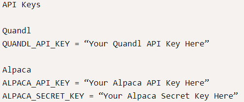

# Project Title

The financial planner application is a python jupyter lab interface program.  It collects data via API methods, prepares data as Pandas Dataframe, and simluate the future forecasts with Monte Carlo simulation module.  The user can simulate future cumulative return by specifying the profolio current income, weights of stock vs bonds, forecast periods, and number of simulations.  The output will enable user to assess 95% confidence interval's cumulative return amount.

---

## Technologies

This project leverages python 3.7 with the following packages:

* [Jupyter Notebook](https://jupyter-notebook-beginner-guide.readthedocs.io/en/latest/what_is_jupyter.html) - It's a server-client application that allows editing and running notebook documents via a web browser.

* [pandas](https://pandas.pydata.org/pandas-docs/stable/index.html) - For Series, DataFrame, and plots

* [pathlib](https://docs.python.org/3/library/pathlib.html) -For object-oriented filesystem paths 

* [%matplotlib inline](https://pythonguides.com/what-is-matplotlib-inline/#:~:text=What%20is%20matplotlib%20inline%20in%20python%20IPython%20provides,two%20types%20of%20magic%20functions%2C%20line-oriented%20and%20cell-oriented.) - For Cell-oriented magic functions


* [os](https://docs.python.org/3/library/os.html) - For creating and removing a directory (folder), fetching its contents, changing and identifying the current directory, etc

* [requests](https://pypi.org/project/requests/) - For send HTTP requests using Python

* [JSON](https://docs.python.org/3/library/json.html) - For providing an API similar to convert in-memory Python objects to a serialized representation known as JavaScript Object Notation (JSON) and vice-a-versa

* [dotenv](https://pypi.org/project/python-dotenv/) - For allowing user to specify environment variables in traditional UNIX-like “.env” (dot-env) file within your Python project directory

* [alpaca-trade-api](https://pypi.org/project/alpaca-trade-api/) - For  rapid trading algo development easily, with support for both REST and streaming data interfaces.

* [MCForecastTools](https://pypi.org/project/mc-simulation/) - For configure, run, and evaluate a Monte Carlo simulation by using the stock information that an Alpaca API call returns

---


## Installation Guide

Before running the application first install the following dependencies.

```python
  pip install pandas
  pip install jupyterlab
  pip install python-dotenv
  pip install alpaca-trade-api
```


## Usage

To use the loan qualifier app, simply clone the `financial_panner' from the respository, open jupyter lab and open **financial_planning_tools.ipynb** with:

```python
jupyter lab
```

Upon launching the financial_planning_tools in jupyter notebook, you will have cells to input the API keys, portfolio shares, values, simulation period, stock/bond weights, row limitation, and forecast period.

Please see below on how to get API keys.

The application requires an Alpaca API keys and QUANDL API key.  
Please sign up Alpaca account to get the API keys.

https://app.alpaca.markets/signup

Please sign up Quandl account to get the API key.

https://data.nasdaq.com/

The API keys are required to store under `.env` file in order for the application to retrieve the API keys.

The following image shows a suggestion for the format:


After inputs, then re-run the jupyter book to produce forecasts and plots for the portfolio simulation with Monte Carlo simulation.


---

## Contributors

Brought to you by FinTech Material and Eunice

---

## License

MIT